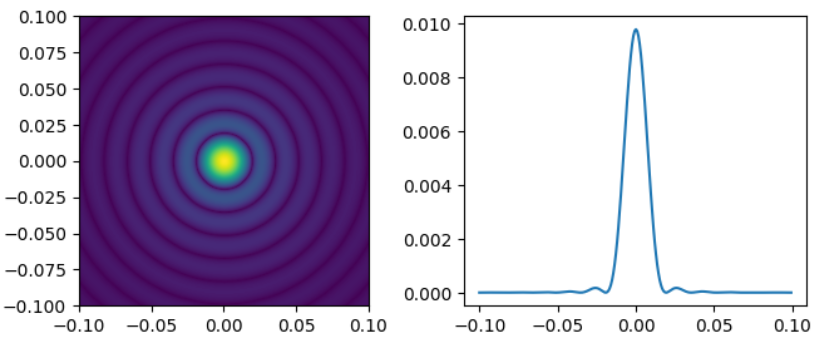

# Scalar diffraction theory tutorial

This repository is intended for creating a solution manual and translating programming code from MATLAB to Python for the textbook "Computational Fourier Optics: A MATLAB Tutorial" by David Voelz, which covers scalar diffraction theory.

  

# Example  
**[Ch. 3 DFT fundamentals ](./example/Ch.3_DFT_fundamentals.ipynb)**  
**[Ch. 4 Scalar diffraction and propagation solutions](./example/Ch.4_Scalar_diffraction_and_propagation_solutions.ipynb)**  
**[Ch. 5 Propagation simulation](./example/Ch.5_Propagation_simulation.ipynb)**  
**[Ch. 6 Transmittance functions, lenses, and gratings](./example/Ch.6_Transmittance_functions,_lenses,_and_gratings.ipynb)**  
**[Ch. 7 Imaging and diffraction limited imaging simulation](./example/Ch.7_Imaging_and_diffraction_limited_imaging_simulation.ipynb)**  

# Reference
1. [David Voelz] Computational Fourier Optics: A MATLAB Tutorial
